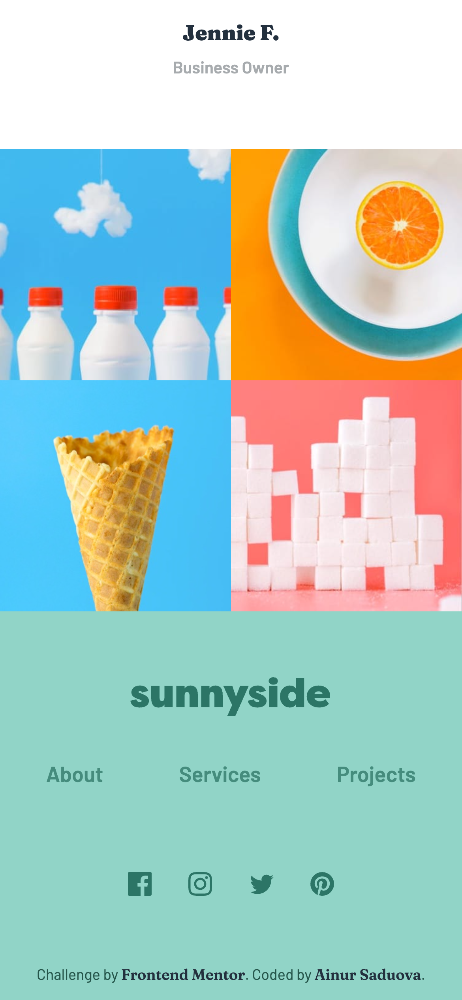
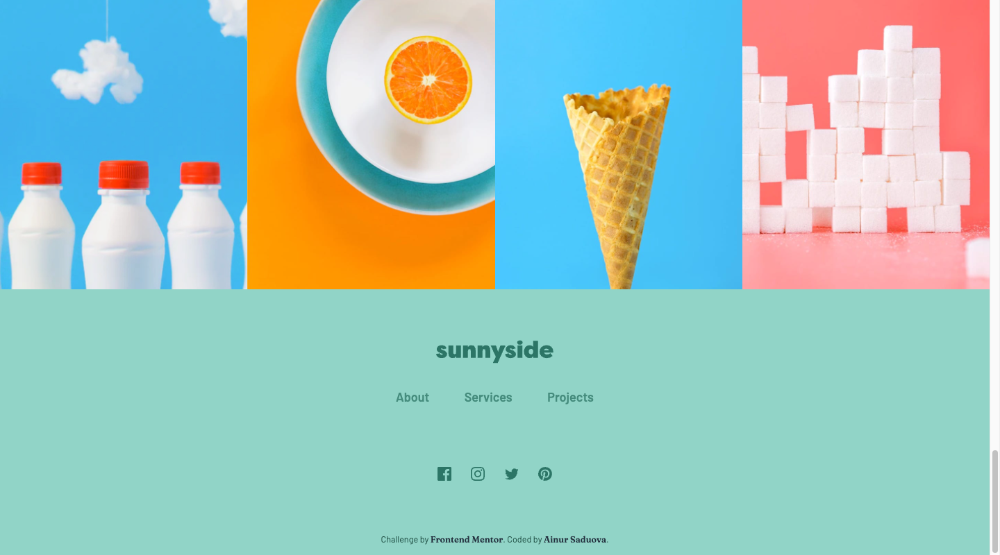

# Frontend Mentor - Sunnyside agency landing page solution

This is a solution to the [Sunnyside agency landing page challenge on Frontend Mentor](https://www.frontendmentor.io/challenges/sunnyside-agency-landing-page-7yVs3B6ef).

## Table of contents

- [Overview](#overview)
  - [The challenge](#the-challenge)
  - [Screenshot](#screenshot)
  - [Links](#links)
- [My process](#my-process)
  - [Built with](#built-with)
  - [What I learned](#what-i-learned)
- [Author](#author)

## Overview

### The challenge

Users should be able to:

- View the optimal layout for the site depending on their device's screen size
- See hover states for all interactive elements on the page

### Screenshot

Mobile views:




Desktop views:



### Links

- Solution URL: [https://github.com/NuraSad/sunnyside-agency-landing-page-main](https://github.com/NuraSad/sunnyside-agency-landing-page-main)
- Live Site URL: [https://nurasad.github.io/sunnyside-agency-landing-page-main/](https://nurasad.github.io/sunnyside-agency-landing-page-main/)

## My process

### Built with

- Semantic HTML5 markup
- Sass
- Flexbox
- CSS Grid
- Mobile-first workflow

### What I learned

I took this challenge as an opportunity to learn Sass, a CSS preprocessor. One of the primary advantages of Sass is that it makes writing CSS more readable and manageable. For instance, the application uses two primary fonts for headings and text, and declaring them as variables streamlines the process. During development, I learned how to use @mixin for theme declaration. This was particularly useful because several elements on the webpage shared the same style, but with different properties such as font size or color. Mixins allowed me to pass color as a variable, making my CSS code more DRY (Don't Repeat Yourself). Overall, I enjoyed working with Sass and plan to continue using it in my projects.
For this project, I adopted a mobile-first workflow to ensure a smooth transition to the desktop version. I employed two techniques:

1. I used the <picture> HTML element instead of . This allowed me to leverage the 'srcset' attribute of the <picture> tag, enabling different image sources for the picture element depending on the user's device width. Consequently, the browser utilized optimized images for both mobile and desktop devices.
2. The webpage features slightly different layouts for mobile and desktop versions. On mobile, each section takes the full width of the screen, and the gallery at the bottom displays four images. In contrast, the desktop version arranges sections in pairs, with the gallery occupying a single row. To achieve this, I used CSS Grid with the auto column property:

```
   display: grid;
   grid-template-columns: repeat(auto-fit, minmax(375px, 1fr));
```

This setup pushes all elements into a single column if the device's width is less than 375px and creates two columns for wider screens.
For the gallery at the bottom of the page, I utilized the CSS Flexbox wrap property, which pushes content into a second row if there isn't enough space on the current row.

## Author

- Website - [Ainur Saduova](https://www.ainursaduova.com/)
- Frontend Mentor - [@NuraSad](https://www.frontendmentor.io/profile/NuraSad)
